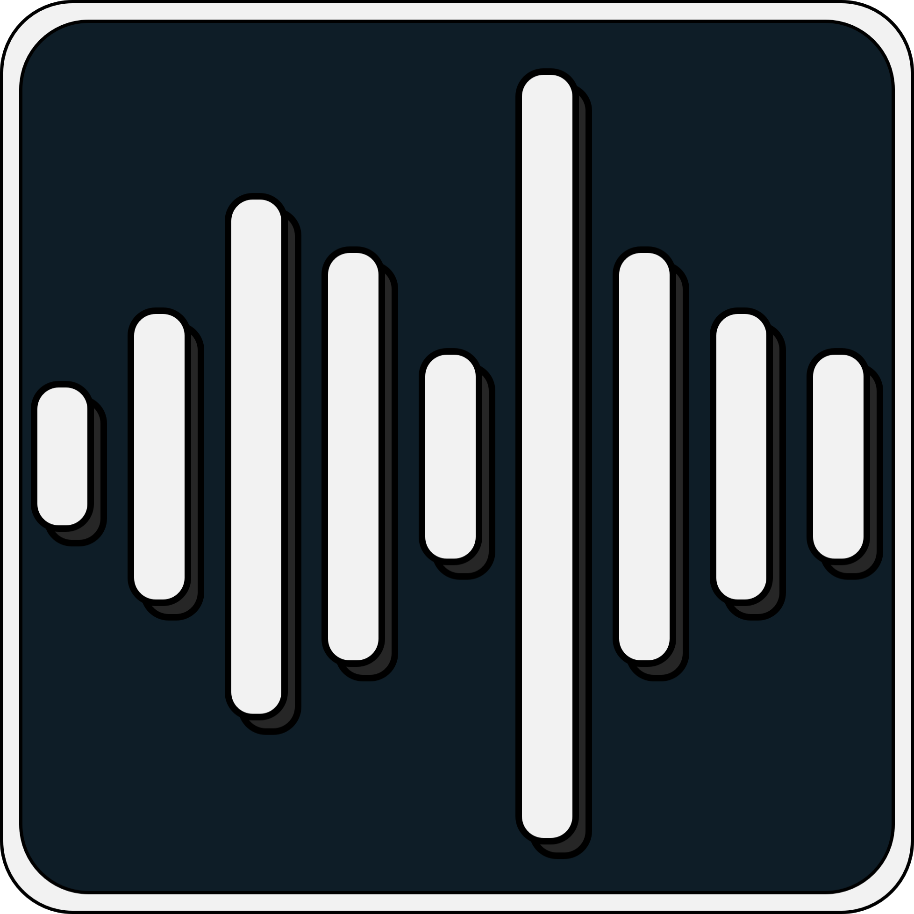
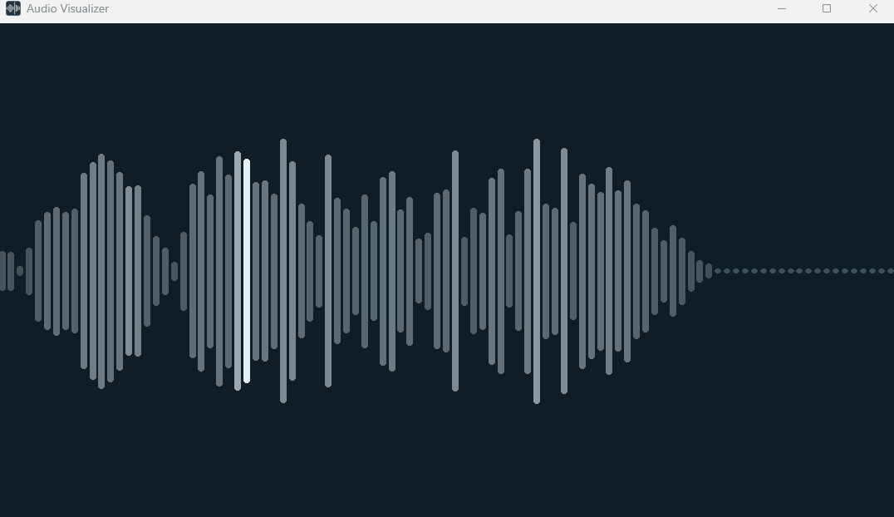
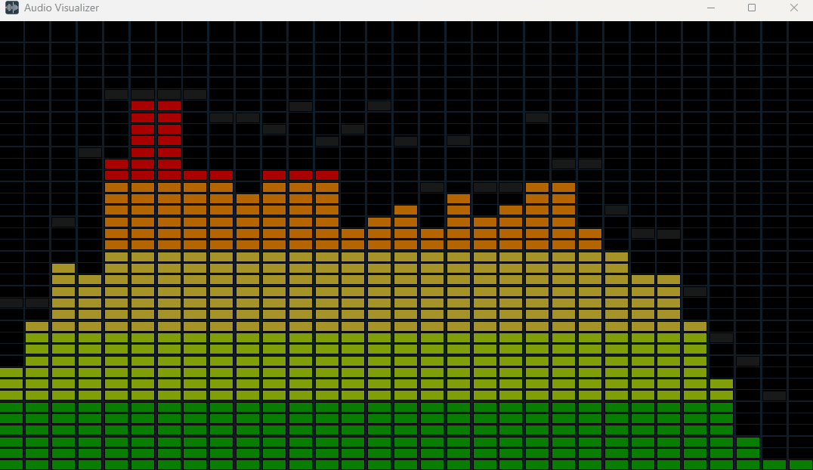

# Audio Visualizer

<p align="center">
  
</p>

A simple **audio visualizer and player** built with **pygame-ce**, **PyAudio**, and **Mutagen**.  
Just drag and drop a **FLAC** or **MP3** file into the window — your track starts playing instantly with live visualization.


---


## 🚀 Features

- 🎧 **Drag & Drop Interface** – Add your music by simply dragging a FLAC or MP3 file into the window.  
- 🔊 **Real-Time Visualization** – Watch your music come alive with smooth, animated frequency bars.  
- 🧭 **Clean UI** – Minimalist controls for **play**, **pause**, **skip**, and **seek**.  
- 🎶 **Supported Formats** – Works with both **FLAC** and **MP3** files as of now.  
- 💻 **Auto Output Switching (Windows)** – Automatically detects and uses the system’s default audio output.  
- ⚙️ **Resizing Behavior** – Normally, SDL windows pause while being resized, but this visualizer keeps running, allowing continuous playback and animation during resizing.

---

## 🛠️ Requirements

- **Python:** 3.11 or higher  
- **pip:** for dependency installation  

All dependencies are listed in [`requirements.txt`](requirements.txt).

---

## 🎹 Controls

| Key | Action |
|-----|--------|
| **Space / P** | Play / Pause |
| **N** | Next Track |
| **A** | Previous Track |
| **←** | Seek backward 10 seconds |
| **→** | Seek forward 10 seconds |

---

## 🎨 Themes

The visualizer currently supports two display themes:

### WhiteBars 
Clean and simple frequency bar layout *(default)* 



### SoundMeter
Retro-style sound meter look 



---

## ⚙️ Installation

```bash
git clone https://github.com/YourUsername/audio-visualizer.git
cd audio-visualizer
python -m venv .venv
```
### On Windows:
```bash
.venv\Scripts\activate.bat
```
### On Mac/Linux:
```bash
source .venv/bin/activate
```

Then install dependencies and run the app:
```bash
pip install -r requirements.txt
python main.py
```
Once running, simply drag and drop a FLAC or MP3 file into the window to start playback.